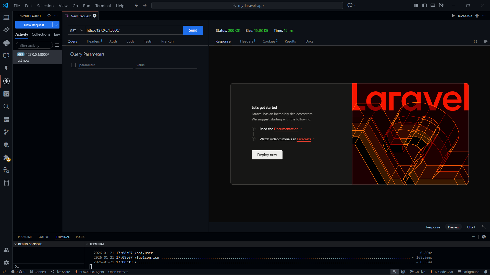
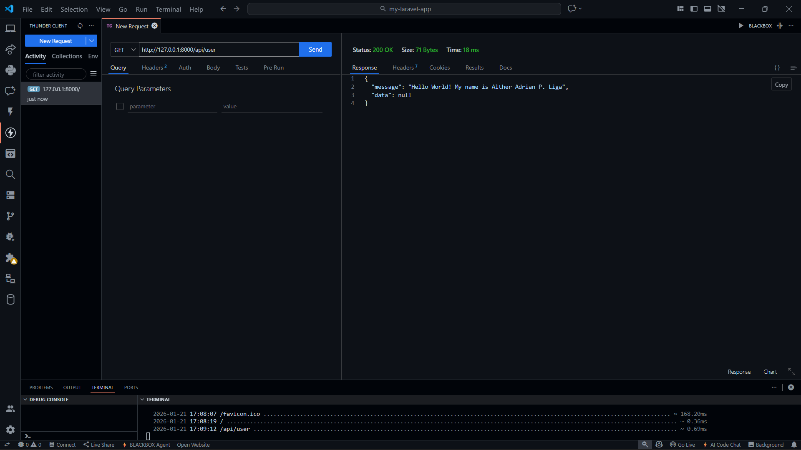
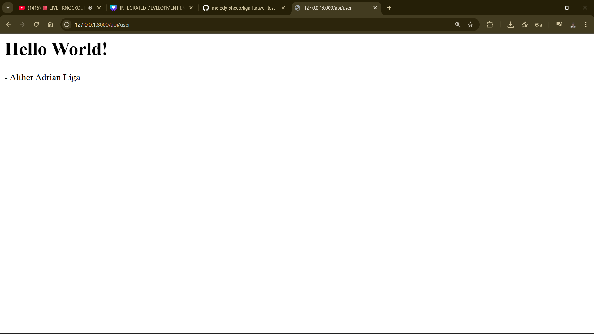
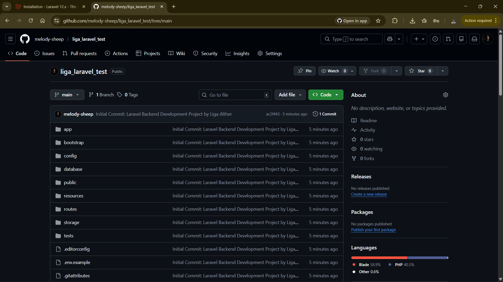

<p align="center"><a href="https://laravel.com" target="_blank"></a></p>

<p align="center">
<a href="https://github.com/laravel/framework/actions"></a>
<a href="https://packagist.org/packages/laravel/framework"></a>
<a href="https://packagist.org/packages/laravel/framework"></a>
<a href="https://packagist.org/packages/laravel/framework"></a>
</p>

## 🚀 Successfully Installed Laravel 12.48.1

### Student Information
- **Name:** Alther Adrian P. Liga
- **Course:** BSIT
- **Year:** 3rd Year
- **Section:** IT3R10
- **Project:** Laravel Application for Integrative Programming & Tech

### Project Screenshots

#### 1. Laravel Welcome Page (Successfully Running)


#### 2. Custom API Route Working


#### 3. Web Route Working


#### 4. Project Structure


### Installation Success Details
✅ **PHP Version:** 8.5.1  
✅ **Laravel Version:** 12.48.1  
✅ **Database:** SQLite (configured)  
✅ **Routes Working:** `/`, `/api/user`, custom routes  
✅ **Server Running:** `php artisan serve`  

### Custom Routes Implemented

#### Web Routes (routes/web.php)
```php
Route::get('/alther', function () {
    return 'Hello World! My name is Alther Adrian P. Liga';
});

Route::get('/profile', function () {
    return '<h1>Alther Adrian P. Liga</h1><p>3rd Year BSIT - IT3R10</p>';
});


About Laravel
Laravel is a web application framework with expressive, elegant syntax. We believe development must be an enjoyable and creative experience to be truly fulfilling. Laravel takes the pain out of development by easing common tasks used in many web projects, such as:

Simple, fast routing engine.

Powerful dependency injection container.

Multiple back-ends for session and cache storage.

Expressive, intuitive database ORM.

Database agnostic schema migrations.

Robust background job processing.

Real-time event broadcasting.

Laravel is accessible, powerful, and provides tools required for large, robust applications.

Learning Laravel
Laravel has the most extensive and thorough documentation and video tutorial library of all modern web application frameworks, making it a breeze to get started with the framework. You can also check out Laravel Learn, where you will be guided through building a modern Laravel application.

If you don't feel like reading, Laracasts can help. Laracasts contains thousands of video tutorials on a range of topics including Laravel, modern PHP, unit testing, and JavaScript. Boost your skills by digging into our comprehensive video library.

Laravel Sponsors
We would like to extend our thanks to the following sponsors for funding Laravel development. If you are interested in becoming a sponsor, please visit the Laravel Partners program.

Premium Partners
Vehikl

Tighten Co.

Kirschbaum Development Group

64 Robots

Curotec

DevSquad

Redberry

Active Logic

Contributing
Thank you for considering contributing to the Laravel framework! The contribution guide can be found in the Laravel documentation.

Code of Conduct
In order to ensure that the Laravel community is welcoming to all, please review and abide by the Code of Conduct.

Security Vulnerabilities
If you discover a security vulnerability within Laravel, please send an e-mail to Taylor Otwell via taylor@laravel.com. All security vulnerabilities will be promptly addressed.

License
The Laravel framework is open-sourced software licensed under the MIT license.
